# 📋 Task Manager

A complete task management application built with **FastAPI** (Backend) and **Next.js** (Frontend)


---

## 📸 Screenshots

### Landing Page

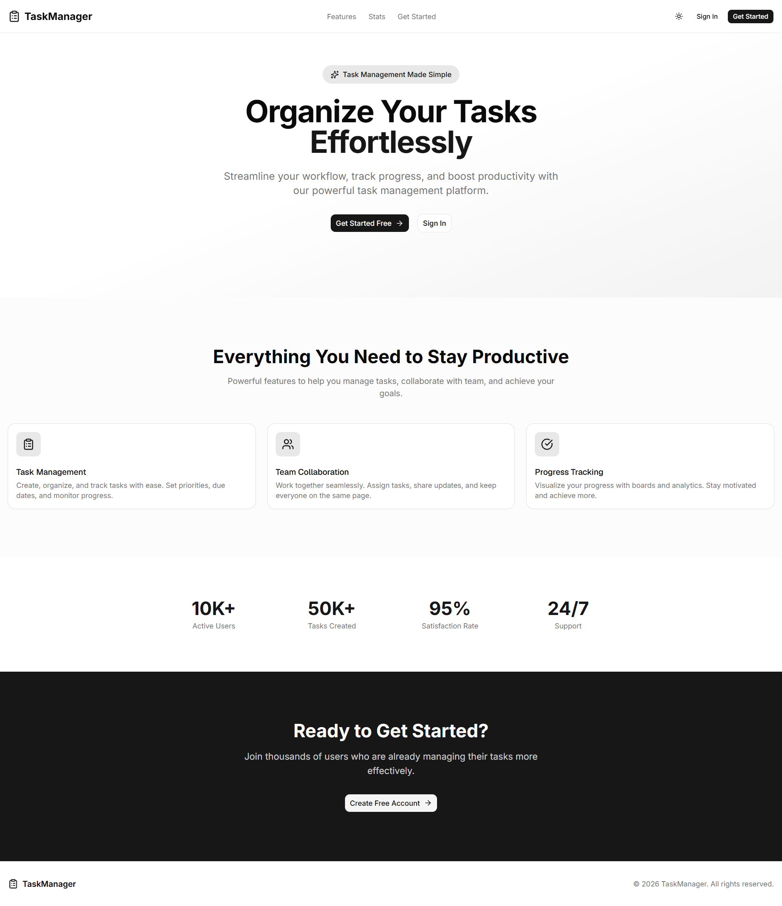

### Authentication

| Login                           | Register                              |
| ------------------------------- | ------------------------------------- |
| 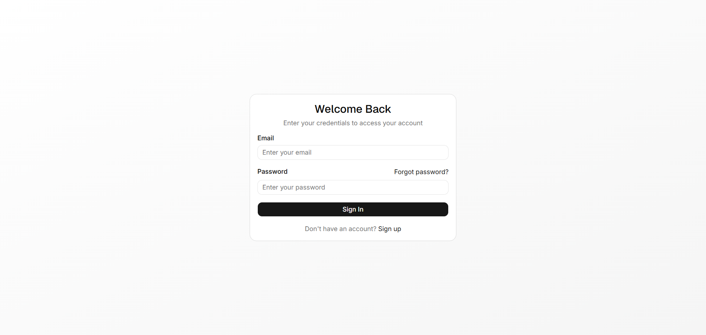 | 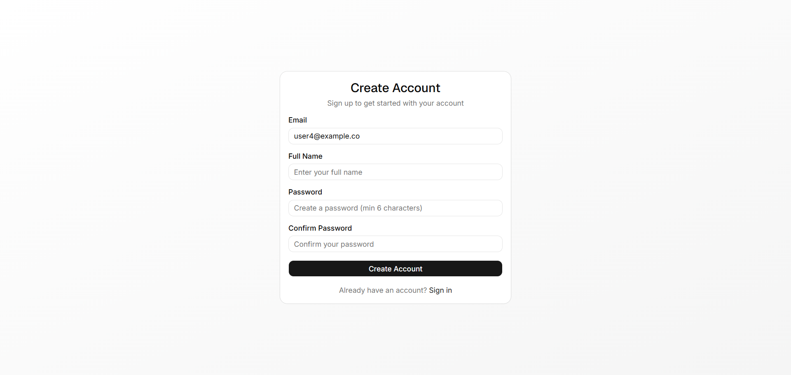 |

### Dashboard & Board

| Dashboard                               | Task Board                      |
| --------------------------------------- | ------------------------------- |
| 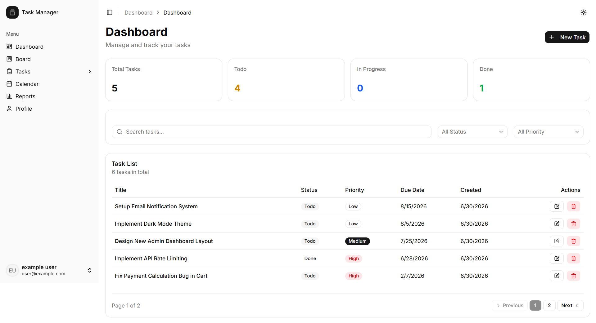 | 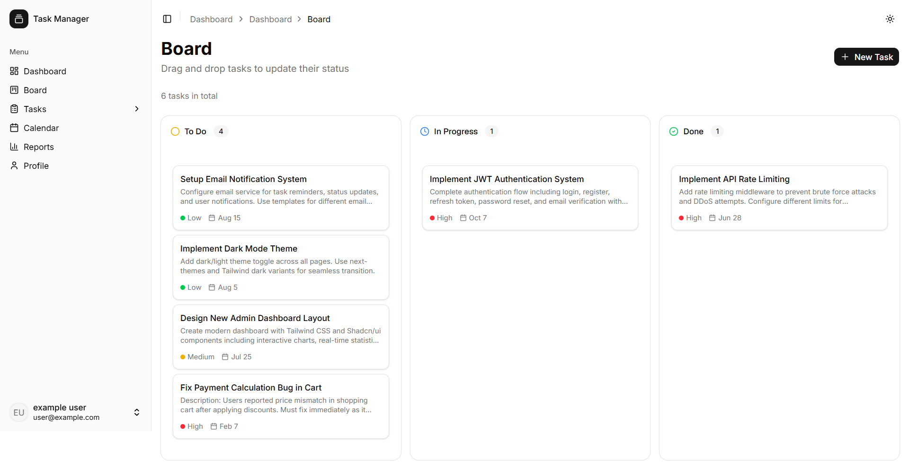 |

### Task Management

| Task List                       | Task Form                               | Task Detail                                 |
| ------------------------------- | --------------------------------------- | ------------------------------------------- |
| 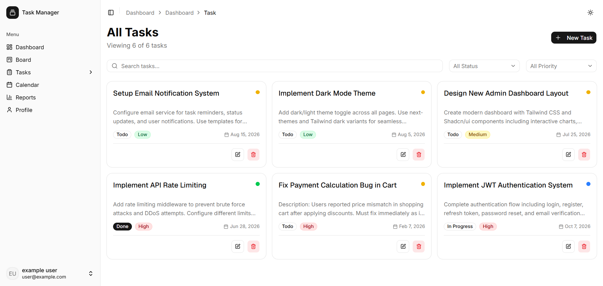 | 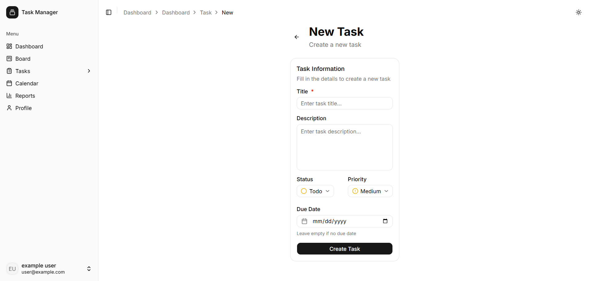 | 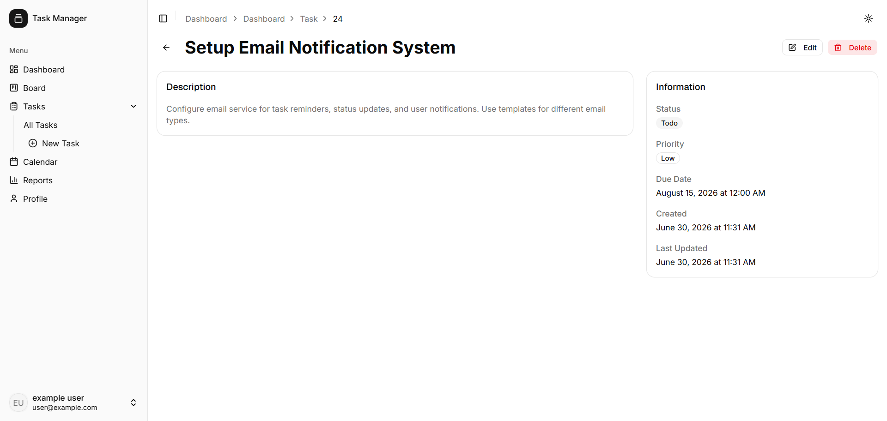 |

### Calendar & Reports

| Calendar                              | Reports                             |
| ------------------------------------- | ----------------------------------- |
| 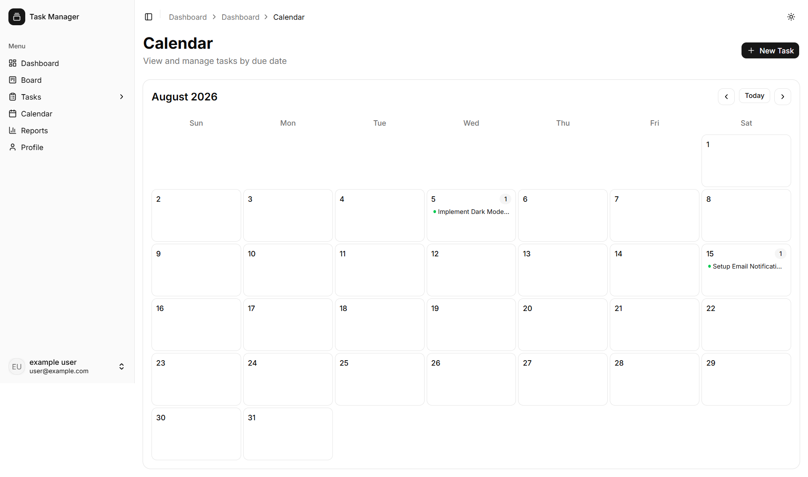 | 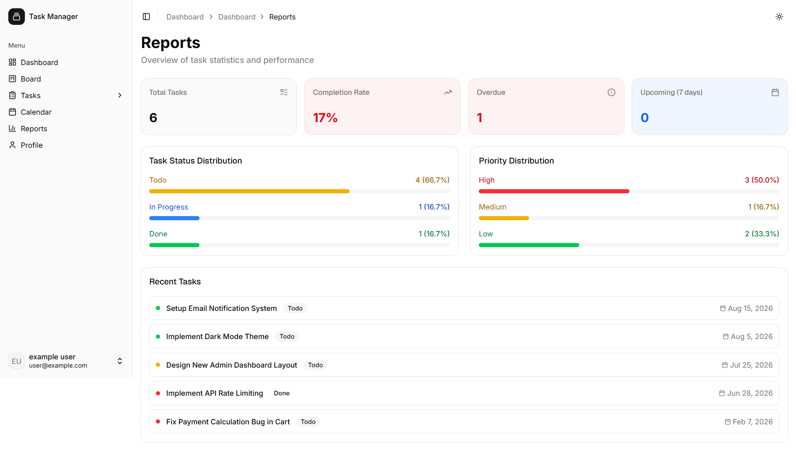 |

### Profile & API

| Profile                             | API Documentation                   |
| ----------------------------------- | ----------------------------------- |
| 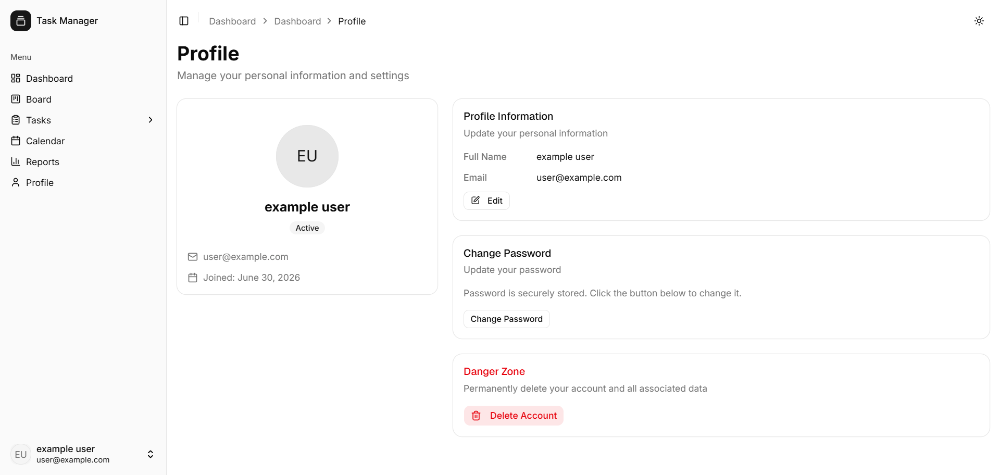 | 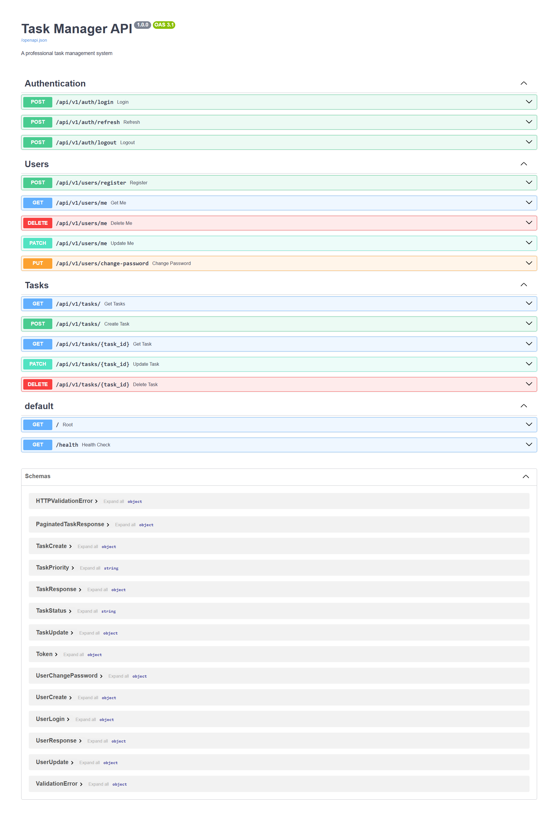 |

### Dark Mode

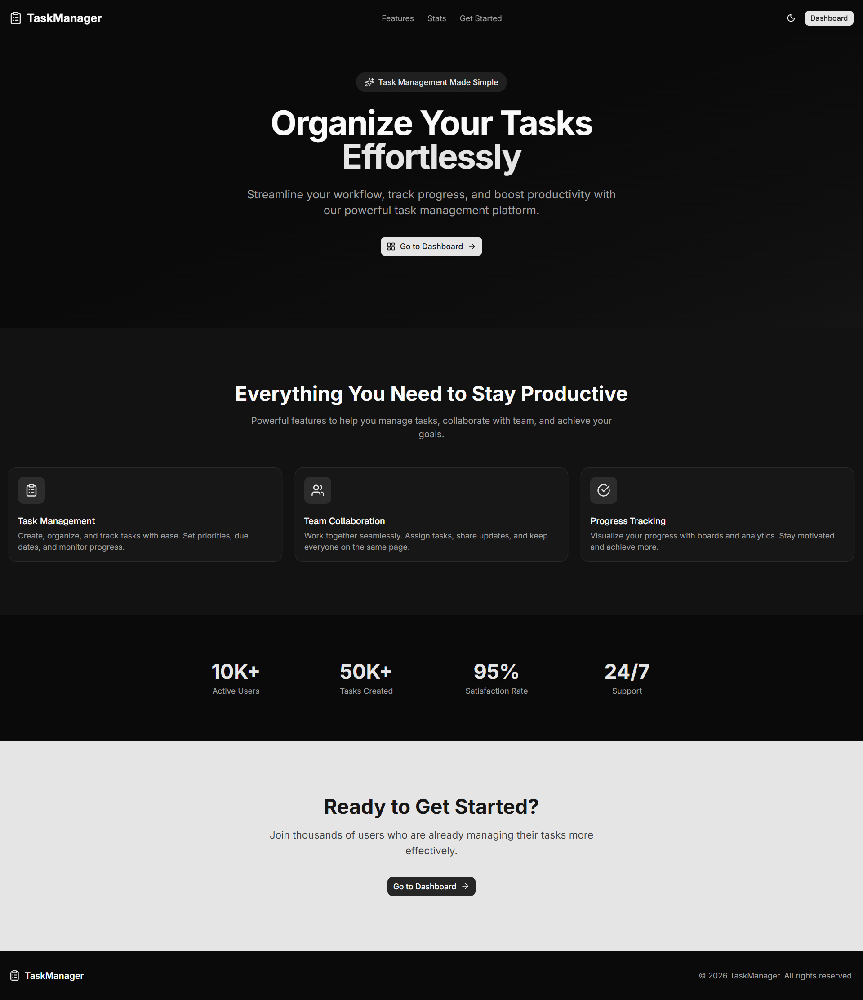

## 🌐 Live Demo

- **Frontend:** [task-manager-frontend-lyart-nu.vercel.app](https://task-manager-frontend-lyart-nu.vercel.app)
- **Backend API:** [task-manager-api-beige.vercel.app](https://task-manager-api-beige.vercel.app)
- **API Documentation:** [task-manager-api-beige.vercel.app/docs](https://task-manager-api-beige.vercel.app/docs)

---

## ✨ Features

### 🔐 Authentication

- User registration and login
- JWT Authentication with HttpOnly cookies
- Automatic Refresh Token
- Logout functionality

### 📝 Task Management

- Create, edit, and delete tasks
- Status tracking (Todo, In Progress, Done)
- Priority levels (Low, Medium, High)
- Due date management
- Advanced search and filtering

### 📊 Dashboard

- Statistics and charts
- Drag & Drop task board
- Calendar view
- Analytics reports

### 👤 User Profile

- Edit profile information
- Change password
- Delete account

### 🎨 Design

- Modern and professional UI
- Dark/Light mode
- Fully responsive
- Smooth animations

---

## 🛠️ Tech Stack

### Backend

| Technology      | Version | Description          |
| --------------- | ------- | -------------------- |
| **FastAPI**     | 0.115.6 | Python web framework |
| **SQLAlchemy**  | 2.0.36  | Database ORM         |
| **PostgreSQL**  | 15      | Main database        |
| **Alembic**     | 1.14.1  | Migration management |
| **python-jose** | 3.3.0   | JWT Authentication   |
| **passlib**     | 1.7.4   | Password hashing     |
| **Pydantic**    | 2.6.1   | Data validation      |
| **Uvicorn**     | 0.34.0  | ASGI server          |

### Frontend

| Technology       | Version | Description            |
| ---------------- | ------- | ---------------------- |
| **Next.js**      | 16.2.9  | React framework        |
| **TypeScript**   | 5.x     | Type safety            |
| **Tailwind CSS** | 4.x     | Styling                |
| **Shadcn/ui**    | Latest  | UI components          |
| **Zustand**      | 5.0.14  | State management       |
| **React Query**  | 5.101.1 | Server data management |
| **Recharts**     | 3.9.0   | Charts                 |
| **Axios**        | 1.18.1  | HTTP requests          |

---

## 🚀 Run with Docker

### Prerequisites

- [Docker](https://www.docker.com/products/docker-desktop/)
- [Docker Compose](https://docs.docker.com/compose/install/)

### Steps

```bash
# 1. Clone the repository
git clone https://github.com/soheildoos3/task-manager.git
cd task-manager

# 2. Copy environment files
cp backend/.env.example backend/.env
cp frontend/.env.example frontend/.env

# 3. Build and run with Docker Compose
docker-compose up -d --build

# 4. View logs
docker-compose logs -f

# 5. Stop services
docker-compose down
```
